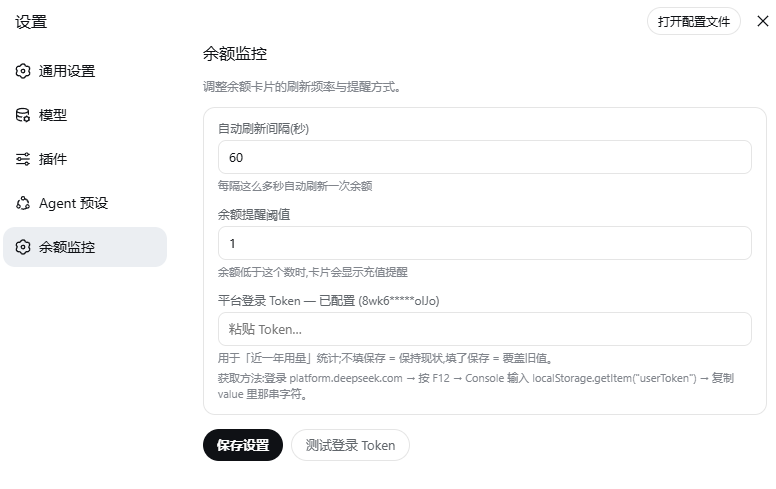

English | [简体中文](README.md)

# dsh-balance-monitor

DeepSeek account balance, right in the dsh sidebar footer.

A minimal [DeepSeek Harness](https://github.com/deepseek-ai/deepseek-harness) (dsh) plugin that shows your DeepSeek API account balance, a thin remaining-ratio bar, and how much the current day has cost — pinned above Settings in the sidebar footer, styled with the stock design tokens.

<p align="center">
  
  
  
</p>

## Features

| What | How |
|---|---|
| Balance | Queries `GET https://api.deepseek.com/user/balance` through the host half, using the `DEEPSEEK_API_KEY` from `$DSH_HOME/.credentials.yaml` (env var wins) |
| Today's spend | The first successful query of a calendar day becomes that day's baseline (persisted in `$DSH_HOME/storages/balance-monitor.json`); spend = `max(0, baseline − current)`. Refills clamp to 0 instead of going negative |
| Auto refresh | The balance polls every 60 seconds by default (real network query); the interval is adjustable in the settings page (5–3600 s). On mount the card shows cached numbers first, then refreshes immediately |
| 12-month usage | Fetched automatically once per page load, and again via the ↻ button. The host half queries the platform's private `usage/amount` + `usage/cost` endpoints month by month with the platform login token (env var > plugin settings > `.credentials.yaml`), aggregates the rolling 12 calendar months, and caches to `$DSH_HOME/storages/balance-usage.json` |
| Settings page | A new entry in the dsh settings list — "Balance Monitor": poll interval, low-balance reminder threshold, and the platform login token (with `sk-` API-key guard, minimum-length check, and save-before-test) |
| Ratio bar | Current balance ÷ day-start baseline, blue → amber → red as it drops |
| Placement | Registered on the official `sidebar.footer.action` slot — above Settings, no patch hacks; the settings page registers on `settings.section` |
| Collapsed rail | Shrinks to a 36px circle with a compact amount and a tooltip |
| Resilience | On upstream failure the last known numbers stay visible (dimmed as stale) instead of an error flash |

## Install

Works from source directly — the browser bundle is a hand-written classic script with **no build step**, so a git install needs no prepare script:

```sh
dsh plugin --profile web add "github:<you>/dsh-balance-monitor#main"
```

or from npm (once published):

```sh
dsh plugin --profile web add dsh-balance-monitor
```

Then restart the Web UI (`dsh --profile web`). The widget appears at the bottom of the expanded sidebar, above Settings.

## How it works

One combined plugin row (`dsh.bundle` patch + `dsh.client` roster declaration):

- **Host half** (`lib/index.js`) — registers one RPC channel `/balance` (loopback trust fence) on `ctx.connection` with three endpoints: `snapshot` (balance + day-spend), `usage` (rolling 12-month totals), and `config` (plugin settings). Each call reads the relevant credential, queries the official API, and answers `{ ok, value }`.
- **Browser half** (`lib/client.js`) — a zero-dependency classic-script bundle registering a `sidebar.footer.action` card and a `settings.section` page. On mount the card shows cached values, then immediately refreshes the balance and fetches the yearly usage; afterwards the balance polls on the configured interval. The settings page adjusts the poll interval, the reminder threshold, and the platform login token.

State and config files (`$DSH_HOME/storages/`):

- `balance-monitor.json` — day-start baseline / spend ledger;
- `balance-usage.json` — cached 12-month usage;
- `balance-monitor-config.json` — plugin settings (poll interval, reminder threshold, platform-token override).

Example (`balance-monitor.json`):

```json
{
  "date": "2026-08-14",
  "dayStart": 100.0,
  "lastTotal": 99.5,
  "lastCurrency": "CNY",
  "updatedAt": 1755200000000
}
```

## Security notes

- The API key and the platform token never leave the host: the browser half only ever sees numbers over the RPC channel, never the credentials.
- The channel is served under the `loopback` trust authority.
- No telemetry. Network traffic: balance polling on the configured interval, the page-load usage query, and manual refreshes (official balance endpoint + platform usage endpoints).
- `DEEPSEEK_PLATFORM_TOKEN` is equivalent to an account login; keep it private. If it expires, sign in again on platform.deepseek.com and refresh it.

## Layout

```
dsh-balance-monitor/
├── package.json        # dsh.bundle (patch) + dsh.client (browser roster)
├── cordis.patch.yml    # inserts the one combined plugin row
├── docs/preview/       # README screenshots
└── lib/
    ├── index.js        # host half: /balance RPC channel
    └── client.js       # browser half: sidebar card + settings page (hand-written, no build)
```

## Development

No toolchain required. Edit `lib/*.js` directly; the bundle format mirrors what the official `tsdown` preset emits (`window.__ModuleLoader__.load({ id, factory })`).

## License

MIT
