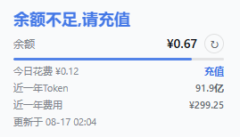

[English](README.en.md) | 简体中文


# dsh-balance-monitor

DeepSeek 账户余额，直接显示在 dsh 侧边栏底部。

一个极简的 [DeepSeek Harness](https://github.com/deepseek-ai/deepseek-harness) (dsh) 插件：在侧边栏底部（设置上方）显示你的 DeepSeek API 账户余额、一条细的余额剩余比例条，以及当天已花费的金额。样式完全使用官方设计令牌，克制内敛。

<p align="center">
  
</p>

## 功能

| 功能 | 实现 |
|---|---|
| 余额 | 服务端调用 `GET https://api.deepseek.com/user/balance`，使用 `$DSH_HOME/.credentials.yaml` 中的 `DEEPSEEK_API_KEY`（环境变量优先） |
| 今日花费 | 当天首次成功查询的余额记为基线（持久化在 `$DSH_HOME/storages/balance-monitor.json`）；花费 = `max(0, 基线 − 当前)`。充值不会让数字变负 |
| 自动刷新 | 余额每 60 秒轮询一次（真实联网），间隔可在设置页调整为 5–3600 秒；挂载时先显示缓存，随后立即刷新一次 |
| 近一年用量 | 每次刷新页面自动查询一次，也可点卡片上的 ↻ 手动刷新；服务端用平台登录 Token（环境变量 > 插件设置页 > `.credentials.yaml`）逐月调用开放平台 `usage/amount` + `usage/cost` 私有接口，汇总近 12 个自然月的 token 消耗与费用，缓存到 `$DSH_HOME/storages/balance-usage.json` |
| 设置页 | dsh 设置列表新增「余额监控」页：自动刷新间隔、余额提醒阈值、平台登录 Token（含 `sk-` API Key 拦截、最小长度校验、测试前先保存） |
| 比例条 | 当前余额 ÷ 当日基线，蓝 → 琥珀 → 红 三档渐降 |
| 位置 | 注册在官方 `sidebar.footer.action` 槽位 —— 设置上方，零 hack；设置页注册在 `settings.section` |
| 折叠态 | 收起后变为 36px 圆形，显示紧凑金额 + tooltip |
| 健壮性 | 上游失败时保留上次数据（变淡标记 stale），不闪错误 |

## 安装

浏览器端 bundle 是手写的 classic script，**无构建步骤**，git 安装无需 prepare 脚本：

```sh
dsh plugin --profile web add "github:<you>/dsh-balance-monitor#main"
```

或从 npm（发布后）：

```sh
dsh plugin --profile web add dsh-balance-monitor
```

然后重启 Web UI（`dsh --profile web`）。卡片出现在展开的侧边栏底部、设置按钮上方。

## 工作原理

一个插件行同时承担两种角色（`dsh.bundle` patch + `dsh.client` 浏览器注册表声明）：

- **服务端半**（`lib/index.js`）—— 在 `ctx.connection` 上注册 `/balance` RPC 通道（loopback 信任围栏），提供 `snapshot`（余额 + 今日花费）、`usage`（近一年用量）与 `config`（插件设置）三个端点。每次调用读取凭证、查询对应接口，返回 `{ ok, value }`。
- **浏览器半**（`lib/client.js`）—— 零依赖 classic-script bundle，注册 `sidebar.footer.action` 卡片与 `settings.section` 设置页。卡片挂载时先读缓存，随后立即刷新余额并自动查询一次近一年用量，之后按设置间隔轮询余额；设置页可调整轮询间隔、提醒阈值与平台登录 Token。

状态与配置文件（`$DSH_HOME/storages/`）：

- `balance-monitor.json` —— 当日基线 / 花费账本；
- `balance-usage.json` —— 近一年用量缓存；
- `balance-monitor-config.json` —— 插件设置（轮询间隔、提醒阈值、平台 Token 覆盖）。

示例（`balance-monitor.json`）：

```json
{
  "date": "2026-08-14",
  "dayStart": 100.0,
  "lastTotal": 99.5,
  "lastCurrency": "CNY",
  "updatedAt": 1755200000000
}
```

## 安全说明

- API key 与平台 token 永不离开服务端：浏览器半只能通过 RPC 通道看到数字，接触不到凭证。
- 通道走 `loopback` 信任策略。
- 无遥测。网络请求为：余额按设置的间隔轮询、页面加载时的用量查询、手动刷新（官方余额接口 + 开放平台用量接口）。
- 平台登录 Token 等同账户登录凭证，请勿外传；失效后在 platform.deepseek.com 重新登录获取。

## 目录结构

```
dsh-balance-monitor/
├── package.json        # dsh.bundle (patch) + dsh.client (浏览器注册表)
├── cordis.patch.yml    # 插入这一个组合插件行
├── docs/preview/       # README 截图
└── lib/
    ├── index.js        # 服务端半：/balance RPC 通道
    └── client.js       # 浏览器半：侧边栏卡片 + 设置页（手写，无构建）
```

## 开发

无需工具链。直接改 `lib/*.js`；bundle 格式与官方 `tsdown` 预设产物一致（`window.__ModuleLoader__.load({ id, factory })`）。

## License

MIT
