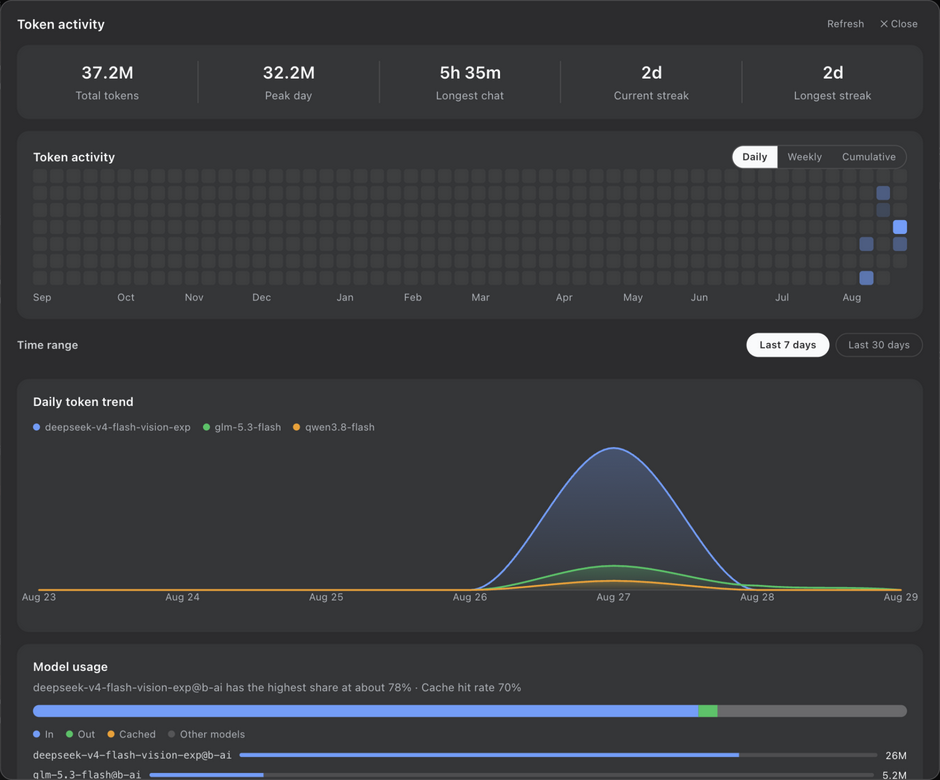

[English](README.en.md) | 简体中文


# dsh-balance-monitor

dsh-balance-monitor 是一个 [DeepSeek Harness](https://github.com/deepseek-ai/deepseek-harness) (dsh) 插件，在侧边栏底部集中展示多个 AI 平台的余额、配额与用量，并提供基于本地会话日志的 Token 热力图看板。

插件按厂商逐行堆叠，每行展示剩余额度、剩余比例条、已用量与当日支出。同一厂商同时提供 Coding Plan（订阅套餐）与 API 按量两种计费方式时，可通过行内的模式圆点在两种口径之间切换；厂商未开放余额或计费接口时，自动退化为 DSH 本地实测用量。界面样式基于官方设计令牌，力求克制内敛。

> 背景：DeepSeek 调价后，用户可能需要切换至智谱等平台，而原插件仅支持 DeepSeek 单一平台。本插件以平台适配器注册表为骨架，动态对接已配置密钥的厂商，并自动纳入 DSH 已接入的 provider。

## 功能特性

| 功能 | 说明 |
|---|---|
| 多厂商堆叠 | 单张卡片自上而下逐厂商一行，展示名称、余额、比例条与已用量 |
| **Coding Plan / API 切换** | 每行的模式圆点（绿 = Coding Plan，灰 = API 按量）展开浮层菜单，切换即写入配置并即时返回新快照，无需编辑文件 |
| **自动跟随 DSH** | 读取 `settings.yaml` 中的 `llm-pi-ai.providers`，自动补入 DSH 已接入的 provider，并通过 baseUrl 反查厂商、推断计费模式 |
| **本地实测用量** | 厂商未开放余额接口（智谱 API、b.ai、百炼、方舟、小米等）时，改以 DSH 会话日志中的实测 token / 请求数展示 |
| **Token 活动看板** | 统计条（累计、峰值、最长聊天、当前 / 最长连续）+ 52 周 token 热力图（每日 / 每周 / 累计三档）+ 近 7 日 / 近 30 日范围切换下的每日趋势图与模型用量卡（对标 ZCode 使用统计），底部保留厂商明细表 |
| 适配器类型 | **balance**（真实余额）、**quota**（滚动窗口配额，多窗口分行展示）、**cost**（近 30 天费用）；另有 **local**（本地实测） |
| 配额取紧约束 | 多窗口时标题展示最紧张的窗口（如 5 小时已重置而本周已满，显示 0% 并倒计时至本周重置） |
| 当日支出 | 余额型平台按日记录基线（持久化到状态文件），支出 = 基线 − 当前值；充值不会导致负数 |
| 通用自定义 | 通过 agent 调用 `balance_monitor` 的 `addCustom` 接入任意 OpenAI 兼容网关，或直接写入 `$DSH_HOME/.credentials.yaml` |
| 收起态圆点 | 侧边栏收起至 36px 后，每厂商显示一个圆点（绿 / 琥珀 / 红按剩余量着色），悬停 tooltip 列出各厂商、数值及当前模式 |
| 位置 | 注册于官方 `sidebar.footer.action` 槽位，位于设置上方 |
| 健壮性 | 60 秒轮询，切回标签页立即刷新；上游失败时保留上次数据并标记为 stale，不闪错误 |
| 双语 | 跟随 dsh 界面语言（`navigator.language`）自动切换中 / 英 |
| 安全 | API Key 仅存于服务端，浏览器只获取数字快照 |

## 支持的平台

内置 14 家厂商，各家声明所支持的计费模式；同一密钥的两种模式共用，切换仅改变展示口径：

| id | 显示名 | 环境变量 key | 模式 |
|---|---|---|---|
| deepseek | DeepSeek | `DEEPSEEK_API_KEY` | API 按量（余额 ¥） |
| zhipu | 智谱 GLM | `ZHIPU_API_KEY` | Coding Plan 配额（积分窗口）· API 按量（本地实测） |
| zai | Z.ai（GLM 国际站） | `ZAI_API_KEY` | Coding Plan 配额 · API 按量（本地实测） |
| moonshot | Kimi / 月之暗面 | `MOONSHOT_API_KEY` | Kimi For Coding 配额（5h + 周）· API 余额 ¥ |
| minimax | MiniMax | `MINIMAX_API_KEY` | Coding Plan 配额 · API 按量（本地实测） |
| stepfun | 阶跃星辰 | `STEPFUN_API_KEY` | API 余额 ¥ |
| dashscope | 阿里百炼 Qwen | `DASHSCOPE_API_KEY` | API 按量（本地实测） |
| volcengine | 火山方舟 Doubao | `ARK_API_KEY` | API 按量（本地实测） |
| xiaomi | 小米 MiMo | `XIAOMI_API_KEY` | API 按量（本地实测） |
| siliconflow | 硅基流动 | `SILICONFLOW_API_KEY` | API 余额 ¥ |
| openrouter | OpenRouter | `OPENROUTER_API_KEY` | API credits $ |
| xai | xAI (Grok) | `XAI_API_KEY` | API credits $ |
| openai | OpenAI | `OPENAI_API_KEY` | API 近 30 天费用 $ |
| anthropic | Anthropic | `ANTHROPIC_API_KEY` | API 近 30 天费用 $（需 Admin key） |

## 计费接口实测

以下为各厂商计费接口的实测情况，供配置时参考：

- **智谱**：无公开余额接口（`/api/biz/balance/query` 拒绝访问，其余返回 404），API 模式走本地实测；Coding Plan 模式走 `/api/monitor/usage/quota/limit`，按 `unit` 识别窗口（3 = 5 小时、2 = 日、1 = 月、6 = 周），支持 `TOKENS_LIMIT / CREDIT_LIMIT / TIME_LIMIT` 三种限额。
- **b.ai**：无计费接口（一律返回 `403 HTTP node only allows access to inference API paths`），自动注册为 `dsh:b-ai` 本地实测行。
- **MiniMax**：`/coding_plan/remains` 需要 cookie，`/v1/token_plan/remains` 接受 Bearer，插件内置后者。
- **负余额**：余额为负（欠费）时不绘制进度条，数值照常展示。

## Coding Plan / API 切换

点击每行右侧的模式圆点（绿 = Coding Plan，灰 = API 按量），在浮层菜单中选择：

1. 浏览器向 `/balances` 发送 `{action:'setMode', id, mode}`；
2. 服务端写入 `$DSH_HOME/balance-monitor.config.json` 的 `platforms.<id>.mode`；
3. 接口即时返回新快照，卡片原地更新，无需重启或刷新。

模式优先级：**手动覆盖 > 按 DSH baseUrl 推断（`/coding`、`/paas/coding`、`anthropic` 判为套餐，其余为按量）> 该厂商首个已配置密钥的非本地模式**。

## 配置密钥

无需额外配置文件：配置了密钥的厂商会被自动展示，DSH 已接入的 provider 也会自动补入。密钥先读取环境变量，否则读取 `$DSH_HOME/.credentials.yaml`：

```yaml
# `$DSH_HOME/.credentials.yaml`
DEEPSEEK_API_KEY: sk-xxxx
ZHIPU_API_KEY: xxxx
MOONSHOT_API_KEY: sk-yyyy
```

环境变量优先：`ZHIPU_API_KEY=xxxx dsh --profile web ...`。

## 通用自定义平台

通过 agent 调用 `balance_monitor` 的 `addCustom` 接入任意 OpenAI 兼容网关 / 反向代理 / 小厂商（仅写入配置，字段如下）：

| 字段 | 说明 |
|---|---|
| `label` | 卡片上显示的名字（自动生成 id） |
| `baseUrl` | 如 `https://gateway.example.com` |
| `path` | 默认 `/v1/user/balance` |
| `auth` | `bearer`（默认）/ `raw`（原样写进 Authorization）/ `x-api-key` |
| `kind` | balance（余额条）/ quota（配额百分比窗口） |
| `currency` / `modeLabel` | 显示币种 / 模式名 |
| `keyEnv` | 读取的 env / `.credentials.yaml` 条目；留空则按 `label` 自动生成 `XXX_API_KEY` |
| `apiKey` | 直接写入 `$DSH_HOME/.credentials.yaml`（仅存服务端，不回显） |
| `pick` | 取值映射：剩余 / 总额 / 重置时间路径，如 `data.balance` |

若映射取不到数值，会明确提示「按映射取不到数值，检查字段路径（如 data.balance）」，不会静默显示 0。

配置前建议先用 `curl -H "Authorization: Bearer $KEY" <base><path>` 查看真实响应：不同厂商的前缀不统一，例如 DeepSeek 的返回不含 `data` 包装，正确路径为 `balance_infos.0.total_balance`（路径以 `.` 分段，数组下标可直接写作数字）。

## 可选配置

```json
{
  "platforms": {
    "zhipu": { "label": "智谱GLM", "enabled": true, "mode": "coding" },
    "deepseek": { "enabled": false }
  },
  "custom": [
    { "id": "custom-mygateway", "label": "我的网关", "baseUrl": "https://gw.example.com",
      "path": "/v1/user/balance", "auth": "bearer", "kind": "balance", "currency": "CNY",
      "pick": { "remaining": "balance", "total": "total_balance", "resetAt": "" } }
  ]
}
```

## Token 活动看板

点击 `▦ Token 活动` 打开看板。数据全部来自本地 `$DSH_HOME/sessions/*/*/session.jsonl[.zstd]`，不调用任何厂商接口，因此「本地实测」型厂商同样有数据。看板布局对标 ZCode 桌面端「使用统计 · 应用用量」，并适配 dsh 的双主题设计令牌。



- **统计条（5 格）**：累计 Token 数（所有会话的 in + out 之和，缓存读取仅计入 tooltip 与脚注；采用 `亿` / `万` 中文计数）、峰值 Token 数、最长聊天时长（相邻事件间隔超过 30 分钟即断开，避免将跨天挂机计为会话）、当前 / 最长连续天数
- **Token 活动热力图**：52 周（约一年）贡献墙样式，周一对齐，月份轴置于图下方，颜色按 `sqrt` 分 5 档；支持每日 / 每周 / 累计切换，单元格 tooltip 展示日期、tokens、请求、轮次、时长与缓存读
- **时间范围**：近 7 日 / 近 30 日 切换，作用于下方趋势图与模型用量
- **每日 Token 趋势图**：手写 SVG 平滑曲线（单调三次插值，不过冲）+ 渐变面积填充，展示范围内 Top 3 模型的每日用量曲线，悬停显示各模型当日 tokens
- **模型用量**：Top 1 模型占比描述 + Cache 命中率；输入 / 输出 / 缓存 / 其他模型四色构成堆叠条；Top 3 模型明细行（由服务端下发的模型×日矩阵按范围切片聚合）
- **平台表**：各厂商 Token / 请求 / 活跃天数（本插件特色，保留在面板底部）
- **脚注**：最近刷新时间、口径说明（活跃天数 / 轮次 / 会话数 / 聊天总时长 / 缓存读未计入）

解析说明：dsh 的 `.zstd` 文件为多帧拼接流，`zstdDecompressSync` 仅解出第一帧；插件按 magic `28 B5 2F FD` 切帧逐帧解压再拼接（实测 32621 帧，0 失败）。按 `size + mtimeMs` 生成指纹缓存（`$DSH_HOME/storages/balance-monitor-usage.json`），冷扫约 2 秒、命中约 300 毫秒；重启后先以缓存摘要秒开，再于后台重扫。缓存版本 v4 起模型维度携带 in/out/cache 拆分与模型×日矩阵，供前端按时间范围切片。

## 安装

浏览器端 bundle 为手写 classic script，无构建步骤：

```sh
dsh plugin --profile web add "github:<you>/dsh-balance-monitor#main"
```

完成后重启 Web UI（`dsh --profile web`）。修改 `lib/client.js` 后刷新页面即可生效；修改 `lib/index.js` / `providers.js` / `usage.js` 需重启 dsh。

## 工作原理

- **服务端** `lib/index.js`：注册 `/balances` RPC 通道（loopback 信任围栏），动作含 `snapshot` / `setMode` / `setEnabled` / `setLabel` / `saveCustom` / `removeCustom` / `usage`；所有写操作即时返回新快照。
- **适配器注册表** `lib/providers.js`：厂商 × 模式 × 解析器，含 `matchVendor(baseUrl)` 与 `inferMode(baseUrl)`。
- **用量扫描** `lib/usage.js`：扫描会话日志，按日 / 厂商 / 模型聚合，并产出连续天数与热力图数据。
- **浏览器端** `lib/client.js`：侧边栏卡片（展开 / 收起两态）+ Token 活动看板浮层，面板开合状态存于 `sessionStorage`，刷新不丢失。

每日基线账本（`$DSH_HOME/storages/balance-monitor.json`）按 `平台id:模式` 记账，切换模式不会污染彼此的「当日已用」：

```json
{
  "deepseek:api": { "date": "2026-08-27", "dayStart": 100.0, "lastTotal": 99.5, "spent": 0.5, "updatedAt": 1755200000000 },
  "zhipu:coding": { "date": "2026-08-27", "dayStart": 500, "lastTotal": 372, "spent": 128, "updatedAt": 1755200000000 }
}
```

## 安全说明

- API Key 永不离开服务端，浏览器仅通过 RPC 获取数字快照。
- 通道采用 `loopback` 信任策略。
- 无遥测；网络请求仅面向各平台官方余额 / 配额 / 用量接口，以及本地会话日志读取。

## 目录结构

```
dsh-balance-monitor/
├── package.json        # dsh.bundle (patch) + dsh.client (浏览器注册表)
├── cordis.patch.yml    # 插入这一个组合插件行
└── lib/
    ├── index.js        # 服务端半：/balances 通道、config/账本读写、行装配
    ├── providers.js    # 厂商适配器注册表（模式、鉴权、解析器、baseUrl 反查）
    ├── usage.js        # 会话日志扫描 → 每日 token / 时长 / 连续天数
    └── client.js       # 浏览器半：卡片 + 模式小圆点/浮层 + 热力图看板（手写，无构建）
```

## 开发

无需工具链。修改后执行 `node --check lib/*.js` 校验语法（`client.js` 为 classic script，请勿引入 ESM 语法）。

## License

MIT
